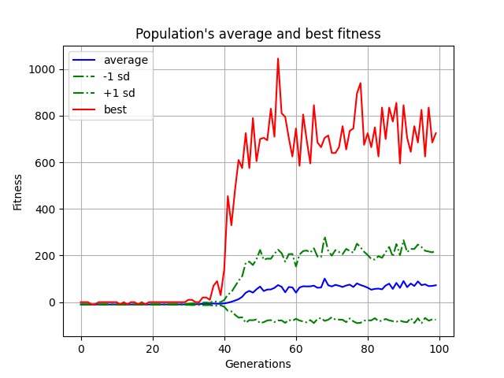
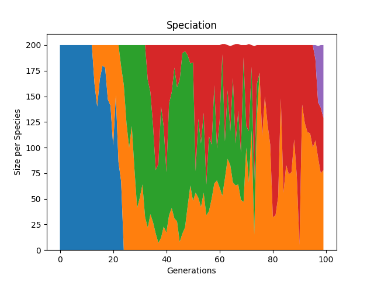
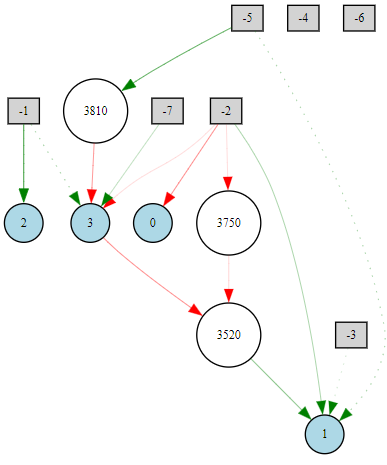
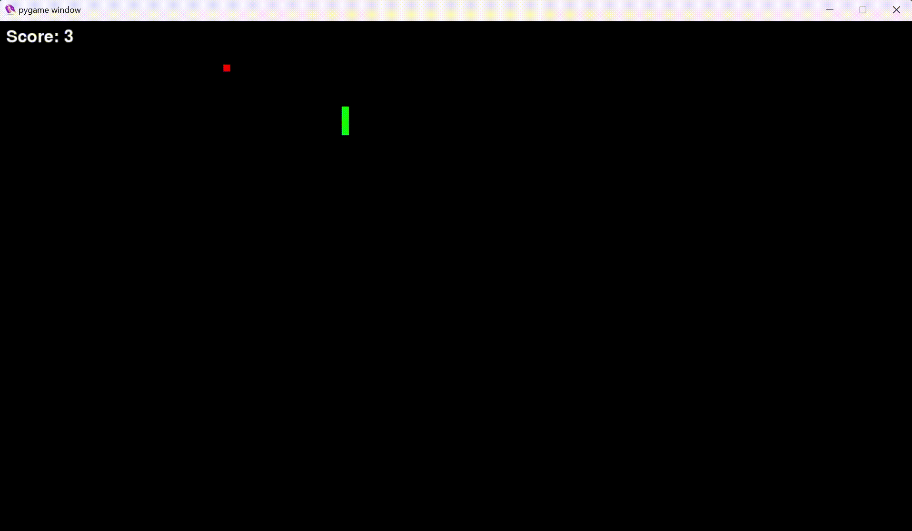

<h1>
    Snake AI using NEAT-python
</h1>


### Performance Metrics After 100 Generations of Evolution

The fitness function evaluates the snake's performance using the following criteria:
- **+10 points**: For consuming food.
- **-10 points**: For either crashing into walls/self or for remaining inactive for a prolonged period.

|  |  |  |
|--------------------------------------------|---------------------------------------------|-----------------------------------------|

<p>
    The model performance begins to stagnate after 55-60 generations. Enhancements can be made by incorporating inputs relevant to the snake's body. Currently, the snake only detects the food and boundaries based on direction.
</p>



<h3>
    Prerequisites
</h3>
<p>
    Ensure you have Python 3.x installed on your system.
</p>

<h3>
    Setup and execution
</h3>

    
```python
    pip install -r requirements.txt
```


```python
    python main.py
```
